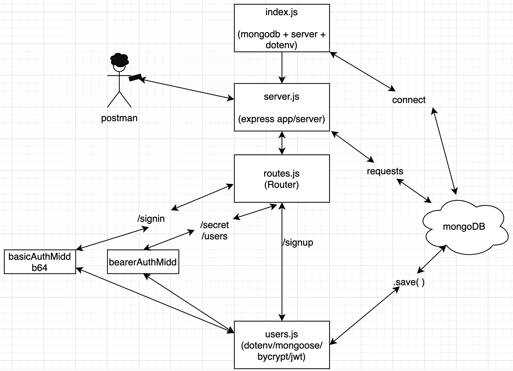

# LAB - Bearer Authorization

## Project: 7

### Author: Mariko Alvarado

### Links and Resources
-  Simon, Stacy, Nathan, Ricardo

- [front-end application](https://mariko-bearer-auth.herokuapp.com/)

### Setup

#### `.env` requirements (where applicable)

- `PORT` - 3000
- `MONGODB_URI` - mongodb://localhost:27017/lab
- `SECRET` - magic

#### How to initialize/run your application (where applicable)

Plug in front end url localhost:3000/signup, /signin, /users, /secrets into postman and send POST/GET requests.

#### Tests

1. install `jest`
2. run `npm test` 

#### UML

